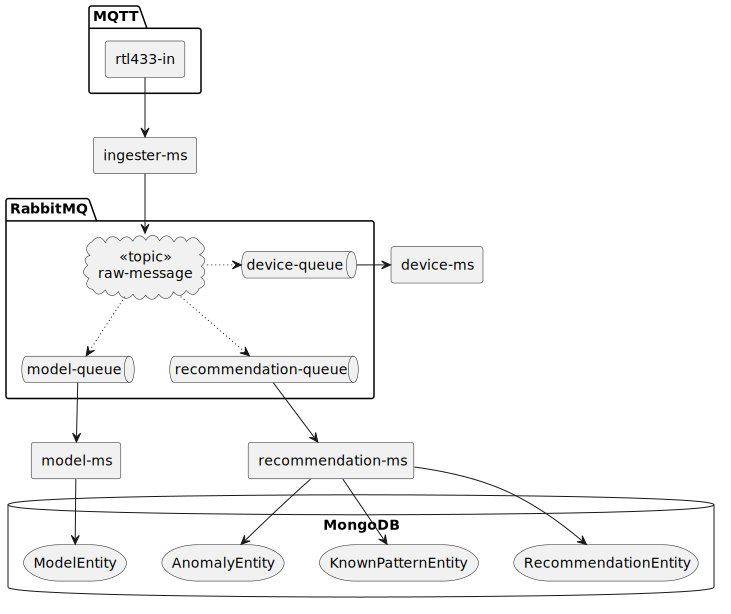

# Overview
This repository provides a Kotlin / Quarkus framework for
- ingesting 433 MHz device data
- generating recommendations for regularly seen devices
- providing a path to promote recommendations to known devices
- transforming known device data into a format suitable for Home Assistant consumption

The following diagram shows the components of the system.


1. IotDataConsumer
  - Registered as a Spring Cloud Stream functional consumer (@Component("iotData")). 
  - Consumes Rtl433Message objects directly from RabbitMQ. 
  - Launches coroutine jobs for parallel handling (via CoroutineScope(Dispatchers.Default)). 
  - Delegates actual logic to:
    - FingerprintService — detects recurrence.
    - RecommendationService — records potential device recommendations.
2. FingerprintService 
   - Maintains hourly (or configured) buckets for recurring device messages. 
   - Uses MongoDB (ReactiveMongoTemplate) for persistence
   - Uses Cache4k to prevent excessive DB writes (acts as a deduplication layer). 
   - Returns (fingerprint, count) for each processed message.
3. RecommendationService
   - Uses a RecommendationRepository (Reactive Mongo repository). 
   - Creates or updates a Recommendation entity when a fingerprint surpasses a configured threshold.
   - This produces a durable record of recurring unknown devices (recommendation candidates).

```aiignore
[RabbitMQ Exchange] → [iotData-in-0 Binding]
        ↓
IotDataConsumer.accept(Rtl433Message)
        ↓
FingerprintService.registerObservation(Rtl433Data)
        ↓
  - Calculates fingerprint
  - Updates count in Mongo bucket
  - Uses Cache4k to reduce DB writes
        ↓
RecommendationService.maybeCreateRecommendation()
        ↓
  - Checks bucket count threshold
  - Saves or updates Recommendation in Mongo

```